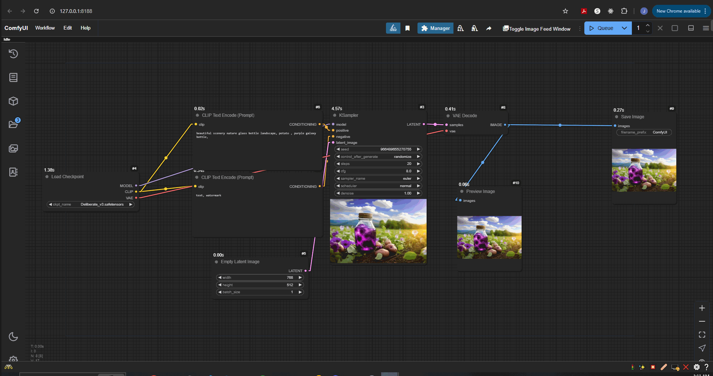
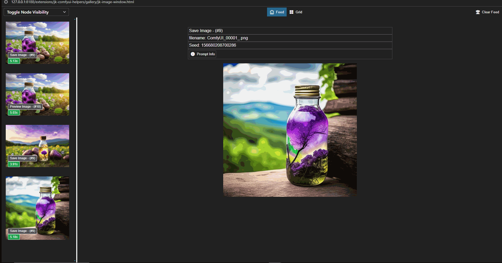
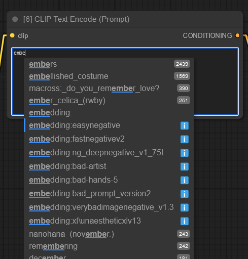
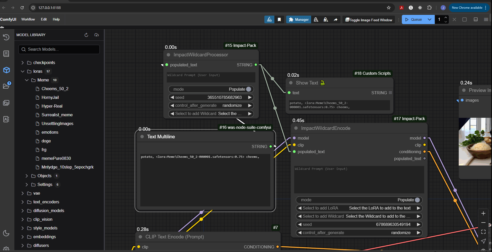
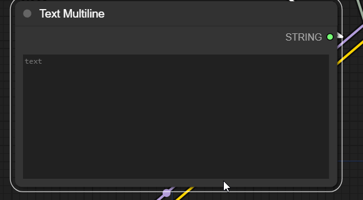
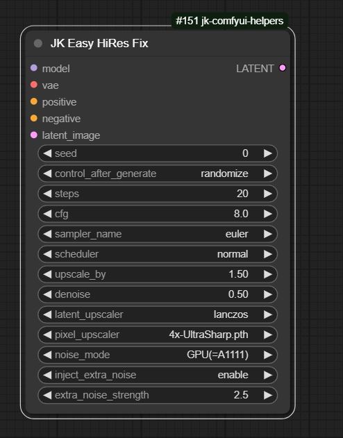

# jk-comfyui-helpers
This repo contains a collection of UI helpers and nodes for ComfyUI

## Features

### Custom Feed Window - Great for multi-monitor setups

   
 A custom feed window that can be moved to another monitor

    </img>

 

 
   
Grid mode or single image

    </img>

 
   
toggle which nodes you want to see output from

    </img>

 
   
JSON prompt explorer (<b>.png only</b>)

    </img>

### Custom Autocomplete (modified from ComfyUI-Custom-Scripts)
  
A customized version of the autocomplete feature from pythongosssss' ComfyUI-Custom-Scripts. This is my attempt to get the comfy prompt editors to work more like the tag autocomplete plugin i was used to in forge/A1111. It includes some bugfixes and the following new features:
* <b> Lora Preferences </b>: Automatically insert preferred activation text and weight for a lora

 

* You can save and edit your preferences by opening the lora dialog via
   - either right clicking a lora in the comfy ui sidebar
   - clicking the info icon inside the autocomplete entry
   - This will bring up a modified version of lora info dialog from ComfyUI-Custom-Scripts with some additional areas where you can set your preferences for the lora
* Also supports Wildcard autocomplete
  
   - automatically detects installed wildcards in any extensions that support them (i think)
   - Add your own custom word files by putting them in the /tags dir of the extension (custom_nodes\jk-comfyui-helpers\tags), this extension comes with danbooru.csv by default, simply delete it if you don't want it
   - supports text or csv format
* For loras to work in prompt, you need a processor for it, i recommend the prompt processors from the [inspire pack](https://github.com/ltdrdata/ComfyUI-Inspire-Pack#prompt-support---these-are-nodes-for-supporting-prompt-processing)

<b>Important</b>: the autocomplete will conflict with the original version from pythongosssss if you have it installed, so disable one of them in the settings manager in comfy

### Easy Hi Res Fix Node
My attempt to replicate the hi res fix process from  A1111/Forge in a single node

* it injects a small amount of extra noise into the latent before upscaling
* noise is generated on the gpu by default, just like A1111/Forge
* it requires the [inspire pack](https://github.com/ltdrdata/ComfyUI-Inspire-Pack) and [ComfyUI Noise](https://github.com/BlenderNeko/ComfyUI_Noise) to be installed. Both can be found by searching the manager.

 
# Installation

## VIA Manager

[TODO](https://github.com/ltdrdata/ComfyUI-Manager#how-to-register-your-custom-node-into-comfyui-manager)

## Manual install
1. Clone the repository:
`git clone https://github.com/kostenickj/jk-comfyui-helpers.git`  
to your ComfyUI `custom_nodes` directory

- For uninstallation:
  - Delete the cloned repo in `custom_nodes`

## Manual Update
1. Navigate to the cloned repo e.g. `custom_nodes/jk-comfyui-helpers`
2. `git pull`

## Credits

pythongosssss/[ComfyUI-Custom-Scripts](https://github.com/comfyanonymous/ComfyUI) - The autocomplete and model dialog is derived on this work.
